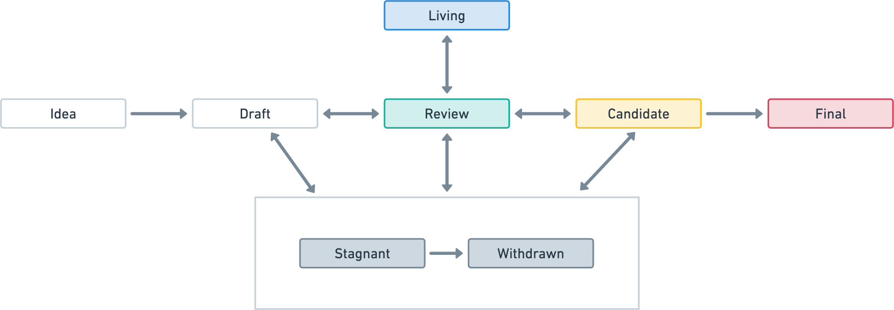

```
REP: 1
Title: Purpose and Guidelines
Status: Living
Type: Process
Created: 19 Jan 2024
```

# REP-1: Purpose and Guidelines

## Table of Contents

- [What is an REP?](#what-is-an-rep)
- [REP Rationale](#rep-rationale)
- [REP Types](#rep-types)
- [REP Workflow](#rep-workflow)
- [REP Format](#rep-format)
- [REP Editors](#rep-editors)
- [Reference](#reference)

## What is an REP?

REP stands for RSS3 Evolution Proposal. Each REP is a document providing information to the RSS3 Community, with regards to all components of the RSS3 Network, such as RSS3 Data Sublayer (DSL) and RSS3 Value Sublayer (VSL). The REP should offer a concise technical specification of the feature or improvement and its rationale. Every REP proposer is responsible for building consensus within the Community and documenting any dissenting opinions. Each REP is identified by a unique index number by the REP Editors.

## REP Rationale

REP is the primary mechanism for proposing new features, collecting Community input, and documenting design decisions that shape the RSS3 Network. Because REPs are maintained as text files in a versioned repository, their revision history is the historical record of the feature proposal.

## REP Types

There are four types of REP:

- **Core**: A Core REP describes functional changes to the RSS3 Network, such as changes to Sublayer parameters, DSL routing algorithm and epoch length. It will affect the implementation of the RSS3 Network.
- **Protocol**: A Protocol REP changes the RSS3 Protocol, affecting how Open Information is structured and delivered to the end users on the DSL. It will affect the implementation of the RSS3 Network.
- **Process**: A Process REP changes the workflow or governance process of the RSS3 network, like this REP itself. It will not affect the implementation of the RSS3 Network.
- **Informational**: An Informational REP clarifies concepts within the RSS3 Network. It will not affect the implementation of the RSS3 Network.

## REP Workflow



*Figure 1: REP workflow*

REPs have the following states:

- **Idea**: Before drafting an REP, discuss your idea with the Community to gauge interest. You can post your idea in the [RSS3 forum](https://forum.rss3.io/) or visit the [rep-discussion channel on Discord](https://link.rss3.io/discord) to engage the Community.
- **Draft**: After gaining support for your idea, draft a document following the REP format and submit a pull request (PR) to this repository. Once the PR is reviewed and merged by REP Editors, it becomes an official REP. Continue advancing your REP by updating it with new PRs.
- **Review**: When the REP enters `Review`, the Community will review it.
- **Candidate**: The REP enters `Candidate` if `Review` is passed, ready to be implemented.
- **Final**: The REP is considered `Final` when it has been implemented in the RSS3 Network. A block height on the VSL will be provided when necessary.

Some exceptional states include:

- **Living**: An REP that requires long-term maintenance, like this REP.
- **Stagnant**: An REP has been inactive for over 6 months will become `Stagnant`. It may re-enter its previous state if resurrected by its Proposer or REP Editors.
- **Withdrawn**: An REP is withdrawn by its Proposer, typically due to changing prerequisites or or the Community's inability to achieve a consensus.

All states can be updated as long as they are not yet `Final`, ensuring efficiency and flexibility.

## REP Format

To maintain clarity, REPs must follow this format (REP-1 is an exception):

- Preamble: At the top of the REP, include metadata such as:
  ```
  REP: 1
  Title: Purpose and Guidelines
  Status: Living
  Type: Process
  Created: [Creation Date]
  Author(s): [Name or Email]
  Description (optional): [Brief Description]
  Discussions (optional): [Links to RSS3 Forum]
  ```
- Abstract: A short paragraph explaining the REP.
- Motivation: A critical section explaining the need for the REP and the problem(s) it is trying to solve.
- Specification: Describe the technical specifications, include diagrams for clarity when necessary.
- Rationale: Additional information supporting the specification.
- Backward Compatibility (optional): Discuss incompatibilities, if any, and offer solutions. If incompatibilities are left unaddressed without justifications, the REP will not progress to `Reivew`.
- Reference Implementations (optional): Necessary before the REP reaches `Final`. If implementation is not needed, this can be omitted.
- License: All REPs are automatically licensed under CC0, you do not need to include a license in your REP.

## REP Editor

For the current REP Editors, see [REP Editors](https://github.com/orgs/RSS3-Network/teams/rep-editors). They are 

In addition, there are specialized Editorial Teams:
- [DSL Editors](https://github.com/orgs/RSS3-Network/teams/dsl-editors) specializing in DSL related REPs
- [VSL Editors](https://github.com/orgs/RSS3-Network/teams/vsl-editors) specializing in VSL related REPs

## REP Editor Responsibilities

The REP Editors are responsible for the overall management of the REP process, including the following:

- Initial PR review
- Assign REP numbers
- Update REP status
- Merge PRs 
- Update README

## Reference

This REP is inspired by the following:

- Bitcoin Improvement Proposals: [BIPs](https://github.com/bitcoin/bips)
- Ethereum Improvement Proposals: [EIPs](https://github.com/ethereum/EIPs/blob/master/EIPS/eip-1.md)
- BNB Chain Evolution Proposal. [BEPs](https://github.com/bnb-chain/BEPs/blob/master/BEPs/BEP1.md)

In many places text was simply copied and modified (yes, including this sentence).